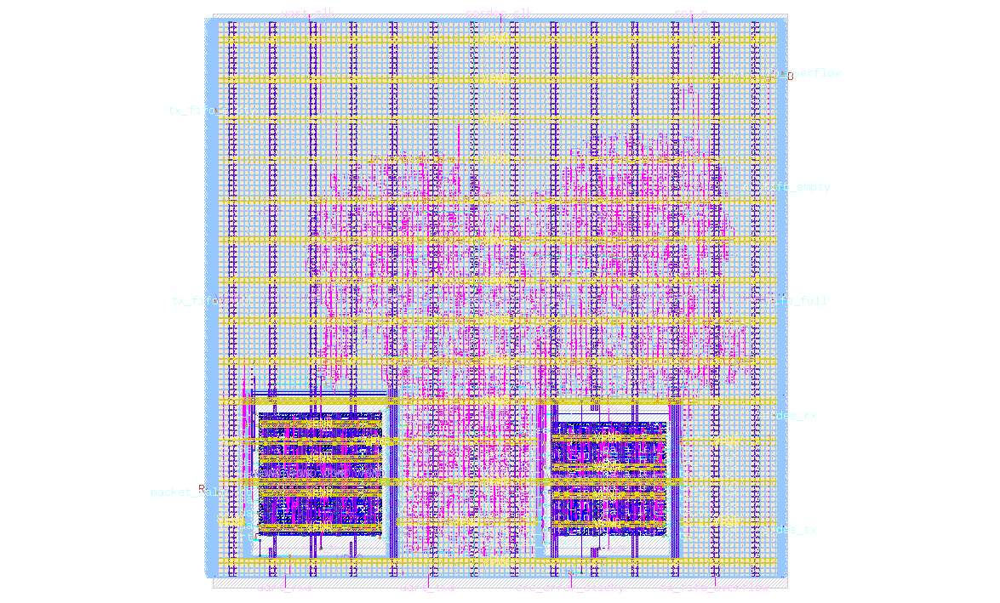
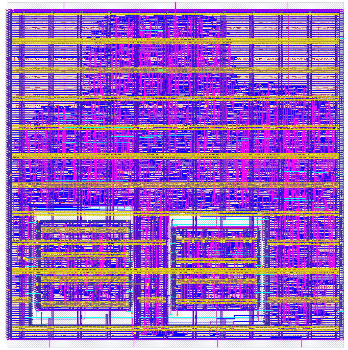
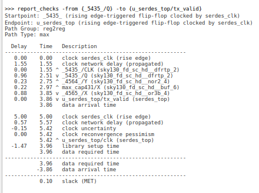
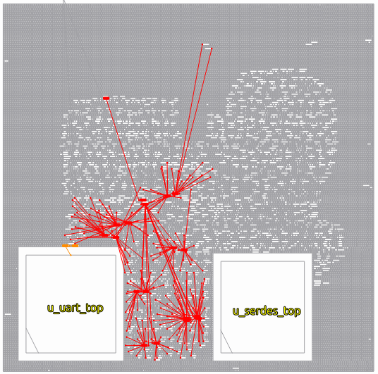
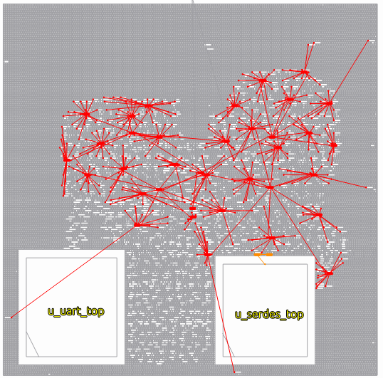
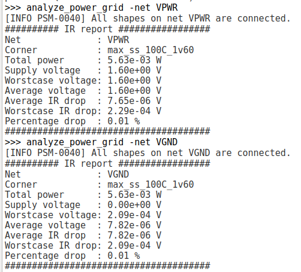
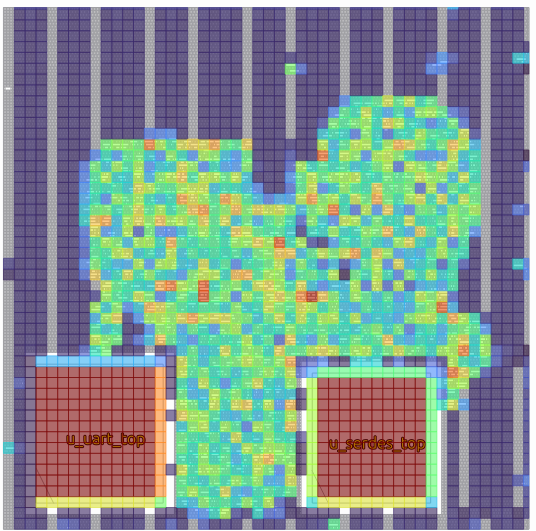
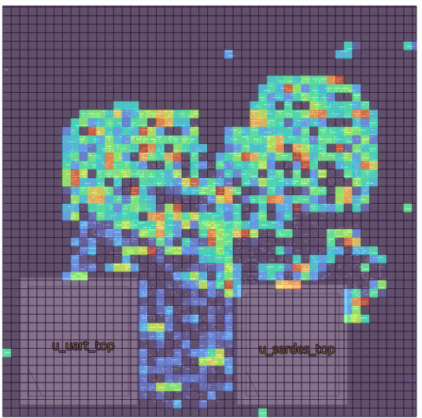
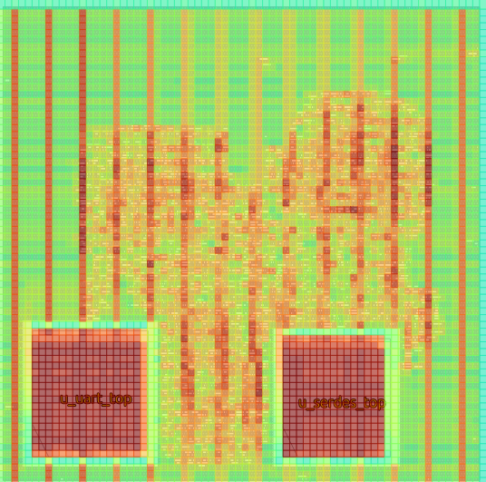

# PacketLink SoC

PacketLink SoC is a small mixed-clock packet transport subsystem implemented in Verilog and hardened with LibreLane on the SkyWater130nm PDK. The design bridges a UART macro and a SERDES macro through packet framing, CRC protection, asynchronous FIFOs, and status reporting logic.

The final hardened run is:
```text
packetlink_soc/runs/final_run
```
and a previous run with some ECO fixes to clean up setup hold violations - 
```text
packetlink_soc/runs/final_run_eco
``` 
is also available for comparison.

## Project Summary

The top-level design receives bytes from a UART interface, buffers them across clock domains, frames them into packets of 4 bytes with a CRC, transmits them through a SERDES macro, receives the serialized loopback stream, deframes and CRC-checks the packet, and returns valid payload bytes to the UART transmit side.

Primary goals:
- Learn how to integrate macros into a top-level design
- Implement robust clock-domain crossing with asynchronous FIFOs
- Safely cross between `uart_clk` and `serdes_clk`.
- Add packet framing with SOP (Start of Packet), length of payload,payload bytes, and CRC fields.
- Preserve status visibility through FIFO flags, overflow indicators, CRC error status, and packet-valid pulses.
- Close RTL-to-GDSII implementation with clean timing, DRC, LVS, antenna, and power-grid checks.

## Architecture

The design contains two main clock domains:

- `uart_clk`: UART-side receive/transmit domain.
- `serdes_clk`: packet framing, SERDES, packet deframing, and high-speed data movement domain.

High-level data path:

```text
uart_rxd
  -> UART macro
  -> TX async FIFO
  -> packet_framer
  -> SERDES macro
  -> serdes_tx / serdes_rx loopback (for this design ) or external serial link (in terms of industry integration)
  -> SERDES macro
  -> packet_deframer
  -> RX async FIFO
  -> UART macro
  -> uart_txd
```

### Integrated Hard Macros

The SoC integrates two pre-hardened macros:

| Macro | Source project | Role in PacketLink SoC |
| --- | --- | --- |
| `uart_top` | `src/uart` | Converts the external UART serial stream into 8-bit receive bytes and converts returned payload bytes back into `uart_txd`. |
| `serdes_top` | `src/serdes` | Encodes each framed byte into a 10-bit symbol, serializes it onto `serdes_tx`, receives `serdes_rx`, reconstructs the 10-bit symbol, and decodes it back to an 8-bit byte. |

#### UART architecture

```text
uart_rxd -> UART RX -> rx_data/rx_valid
tx_data/tx_valid -> UART TX -> uart_txd
```
The UART RTL was created using
[alexforencich's verilog-uart RTL](https://github.com/alexforencich/verilog-uart/tree/master/rtl) as the base UART design. The local project wraps that UART core with a simpler byte-level `valid/ready` interface and hardens the result as a SKY130 macro

The UART baud rate is set by `PRESCALE`.

For the local verification setup:

```text
clk      = 50 MHz
baud     = 115200
PRESCALE = 54
```
The wrapper default is:
```verilog
parameter PRESCALE = 16'd54;
```
Primary testbench:
```text
verify/tb_uart_top.v
```
The testbench loops `uart_txd` back into `uart_rxd`, then checks directed, burst, and randomized byte transfers.

#### SERDES architecture

```text
parallel byte -> 8b/10b encoder -> 10-bit PISO -> serial link
serial link -> 10-bit SIPO -> 10b/8b decoder -> parallel byte
```

The SERDES RTL was created using
[ishfaqahmed29's SerDes repository](https://github.com/ishfaqahmed29/SerDes), which was based on Lattice 8b/10b SERDES documentation. The local project wraps the encoder, decoder, parallel-to-serial, serial-to-parallel, and control FSM
into `serdes_top`, then hardens it as a SKY130 macro.

The SERDES design does not include K28.5 comma symbols or Running Disparity tracking, so it is not a full industry-standard 8b/10b implementation but a simpified version that still provides basic DC balance and transition density.

```text
clk = 200 MHz
```

### Control and status outputs from the design: 

- `tx_fifo_full`
- `rx_fifo_full`
- `tx_fifo_empty`
- `rx_fifo_empty`
- `tx_fifo_overflow`
- `rx_fifo_overflow`
- `crc_error_sticky`
- `packet_valid_pulse`

## Top-Level Ports

| Port | Direction | Description |
| --- | --- | --- |
| `uart_clk` | Input | UART clock domain. |
| `serdes_clk` | Input | SERDES and packet-processing clock domain. |
| `rst_n` | Input | Active-low asynchronous reset, synchronized inside each clock domain. |
| `uart_rxd` | Input | UART receive pin. |
| `uart_txd` | Output | UART transmit pin. |
| `serdes_rx` | Input | Serial receive pin into SERDES macro. |
| `serdes_tx` | Output | Serial transmit pin from SERDES macro. |
| `VPWR` | Inout | Power net when `USE_POWER_PINS` is enabled. |
| `VGND` | Inout | Ground net when `USE_POWER_PINS` is enabled. |

## Module Summary

| Module | File | Purpose |
| --- | --- | --- |
| `packetlink_soc_top` | `src/packetlink_soc_top.v` | Top-level integration of UART macro, SERDES macro, FIFOs, framer, deframer, reset synchronizers, and status logic. |
| `async_fifo` | `src/async_fifo.v` | Dual-clock FIFO using Gray-coded pointers and two-stage pointer synchronization. |
| `packet_framer` | `src/packet_framer.v` | Converts payload bytes into packets with SOP, length, payload, and CRC. |
| `packet_deframer` | `src/packet_deframer.v` | Parses received packets, checks CRC, drops bad packets, and emits valid payload bytes. |
| `crc8` | `src/crc8.v` | Combinational CRC-8 calculation block. |
| `reset_sync` | `src/reset_sync.v` | Reset synchronizer used to create clock-domain-local resets. |

## Packet Format

The framed packet format is:

```text
SOP | LEN | PAYLOAD[0] ... PAYLOAD[N-1] | CRC
```

- SOP byte: `8'hBC`
- Length byte: configured by `PAYLOAD_LENGTH` where default is `4` bytes with a max payload length of `16` bytes.
- CRC coverage: length byte and payload bytes
- CRC excludes the SOP byte

Bad-CRC packets are dropped by `packet_deframer`. A valid packet produces `packet_valid_pulse` and emits payload bytes into the RX FIFO.

## Clock-Domain Crossing

Clock-domain crossings are handled with asynchronous FIFOs:

- TX FIFO: `uart_clk` write side to `serdes_clk` read side.
- RX FIFO: `serdes_clk` write side to `uart_clk` read side.

Each FIFO uses binary and Gray-coded pointers, two-stage pointer synchronizers,
and registered `full`/`empty` flags.

The top-level reset input `rst_n` is synchronized separately into:

- `uart_rst_n`
- `serdes_rst_n`

## Verification

The `verify/` directory contains directed and randomized testbenches:

| Testbench | Purpose |
| --- | --- |
| `tb_crc8.v` | Checks CRC-8 logic against a reference function. |
| `tb_async_fifo.v` | Exercises dual-clock FIFO write/read behavior and registered read latency. |
| `tb_packet_framer.v` | Verifies SOP, length, payload, CRC sequencing, and FIFO read timing. |
| `tb_packet_deframer.v` | Verifies packet parsing, payload emission, packet-valid pulses, and CRC-error handling. |
| `tb_packetlink_soc_top.v` | End-to-end UART-to-SERDES-to-UART style integration test with looped SERDES serial path. |

Useful commands:

```bash
make sim TB_TOP=tb_crc8 TB=verify/tb_crc8.v
make sim TB_TOP=tb_async_fifo TB=verify/tb_async_fifo.v
make sim TB_TOP=tb_packet_framer TB=verify/tb_packet_framer.v
make sim TB_TOP=tb_packet_deframer TB=verify/tb_packet_deframer.v
make sim TB_TOP=tb_packetlink_soc_top TB=verify/tb_packetlink_soc_top.v
```

Gate-level simulation can be run with:

```bash
make netsim RUN_TAG=final_run TB_TOP=tb_packetlink_soc_top TB=verify/tb_packetlink_soc_top.v
```

## Physical Design Configuration

Implementation uses LibreLane/OpenROAD with the SKY130 HD library.

| Setting | Value |
| --- | --- |
| Design name | `packetlink_soc_top` |
| Final run tag | `final_run` |
| UART Clock period | `20.0 ns` |
| SERDES Clock period | `5.0 ns` |
| Timing corners | TT, SS, FF across min/nom/max analysis views |
| UART macro location | `[35, 35]` |
| SERDES macro location | `[290, 35]` |
| Die area | `[0, 0, 500, 500]` |
| Core area | `[5, 10, 490, 495]` |
| Placement density target | `48%` |
| Core utilization target | `40%` |
| Max fanout constraint | `14` |
| Clock uncertainty | `0.15 ns` |
| Time derating constraint | `0.1 ns` |
| PDN nets | `VPWR`, `VGND` |

The design uses explicit macro power connections:

```yaml
PDN_MACRO_CONNECTIONS:
  - "u_uart_top VPWR VGND VPWR VGND"
  - "u_serdes_top VPWR VGND VPWR VGND"
```

## RTL-to-GDSII Results

```text
packetlink_soc/runs/final_run
```

### Timing Summary

| Metric | Result |
| --- | ---: |
| Worst setup slack | `+0.1451 ns` |
| Setup TNS | `0.0000 ns` |
| Setup violation count | `0` |
| Worst hold slack | `+0.0859 ns` |
| Hold TNS | `0.0000 ns` |
| Hold violation count | `0` |
| Max slew violations | `0` |
| Max capacitance violations | `0` |

Worst setup corner:

```text
max_ss_100C_1v60: +0.1451 ns
```

Worst hold corner:

```text
max_ff_n40C_1v95: +0.0859 ns
```

### Physical Verification Summary

| Check | Result |
| --- | ---: |
| Route DRC errors | `0` |
| Magic DRC errors | `0` |
| KLayout DRC errors | `0` |
| LVS errors | `0` |
| LVS unmatched devices | `0` |
| LVS unmatched nets | `0` |
| LVS unmatched pins | `0` |
| Antenna violating nets | `0` |
| Antenna violating pins | `0` |
| Power-grid violations | `0` |

### Area, Utilization, and Routing

| Metric | Value |
| --- | ---: |
| Total instance count | `49,436` |
| Standard-cell count | `5,814` |
| Macro count | `2` |
| Standard-cell area | `38,488.2 um^2` |
| Macro area | `28,157.8 um^2` |
| Total instance utilization | `28.5518%` |
| Standard-cell utilization | `18.7506%` |
| Global-route wirelength | `140,987` |
| Detailed-route wirelength | `92,614` |
| Maximum route wirelength | `503.62` |

### Power Summary

| Metric | Value |
| --- | ---: |
| Internal power | `6.389948 mW` |
| Switching power | `1.951215 mW` |
| Leakage power | `0.201 uW` |
| Total power | `8.341365 mW` |

### IR Drop Summary

| Metric | Value |
| --- | ---: |
| Worst VPWR voltage | `1.79975 V` |
| Worst VPWR drop | ` 0.25003 mV` |
| Worst VGND voltage | `0.225517 mV` |
| Worst VGND drop | `0.225517 mV` |

## Analysis Images

### Final Layout



### Final Layout (more packed with relative fp sizing meeting timing and utilization targets)




### Critical Path



### UART Clock Tree



### SERDES Clock Tree



### IR Drop: VPWR & VGND



### Pin Placement Density



### Power Density



### Routing Congestion



## Notes

- The macro regions may appear fully red in placement-density or routing-resource heatmaps. This is expected because macro bodies are occupied and obstructed regions. Congestion should be judged around macro edges, macro pins, channels, and routing corridors.
- The final reports show raw unannotated clock-load style drivers, but the filtered unannotated net count is `0`; these are not treated as harmful missing SPEF annotations by the flow.
- The final metrics still report `12` max-fanout checks, primarily associated with CTS clock-buffer fanout. Max slew, max capacitance, setup, and hold are all clean.
- `rst_n` is an asynchronous reset and is intentionally synchronized inside the UART and SERDES domains.
- The design uses `VPWR`/`VGND` power pins under `USE_POWER_PINS`; the macros are also connected to these power pins, and the final implementation includes explicit macro power connections in the PDN configuration.


## Key Output Files
Final implementation artifacts are under:
```text
runs/final_run/final/
```
Common files to inspect:
```text
runs/final_run/final/gds/
runs/final_run/final/def/
runs/final_run/final/lef/
runs/final_run/final/nl/
runs/final_run/final/pnl/
runs/final_run/final/spef/
runs/final_run/final/metrics.json
runs/final_run/56-openroad-stapostpnr/summary.rpt
```

## Status

The `final_run` implementation is timing-clean and physically clean across the reported signoff checks.
